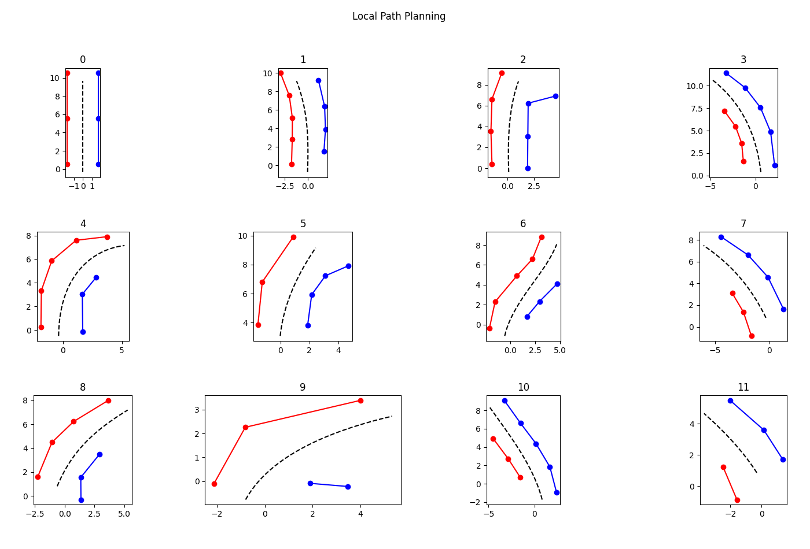

# FSAE 无人赛车路径规划算法

在参加 CIAC2022 算法挑战赛的过程中，在[冀速车队](https://gitee.com/jscd_1)的小伙伴们的帮助下，开发了此用于 FSAE 无人赛车高速循迹项目的局部路径规划算法。由于时间仓促、缺乏经验，此算法仍有诸多不足之处。现将全部代码开源，旨在抛砖引玉、增加交流。




## 相关要求

### 仿真平台与传感器

### 赛道布局

- 直线：不超过80m
- 定半径弯：直径最大50m
- 发夹弯：最小外径9m（弯折处）
- 最小车道宽度为3m
- 复杂赛道：连续弯道、减小半径转弯等
- 赛道左侧边界标记为红色锥桶
- 赛道右侧边界标记为蓝色锥桶
- 赛道两侧不存在边界线
- 赛道终点计时线后安全停车区标记为两侧黄色锥桶
- 同侧锥桶间最大距离为5m
- 在转角处，同侧锥桶间的距离会略有缩小，以提供更好的识别效果
- 赛道标识锥桶根据具体情况会进行间距与宽度调整，且不保证一一对应的状态

## 总体思路


## 部分详解

### 传感器数据处理

```python
test_data = [
    (1039, 2, 1.5719844863476329, 1.3452631698408124),
    (1040, 2, 5.471146464329374, 2.2192398404864857),
    (1041, 2, 7.173426120730759, 3.4437985033604983),
    (1140, 11, 1.1395663052627842, -2.123744520660087),
    (1141, 11, 7.5684376804787785, -0.5507184153002762),
    (1142, 11, 4.873666455657334, -1.6759774141645938),
    (1143, 11, 9.772187208726246, 1.1532440075683486),
    (1144, 11, 11.408631466763312, 3.2716514715137155),
    (1226, 2, 3.6069463444451566, 1.5374350350016928),
]
```

TODO
