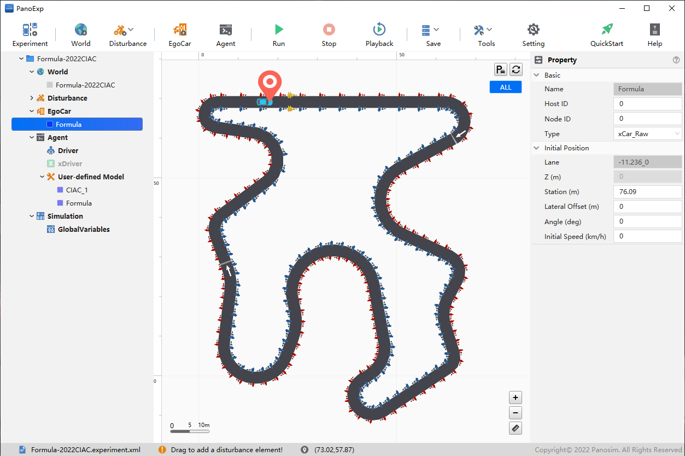
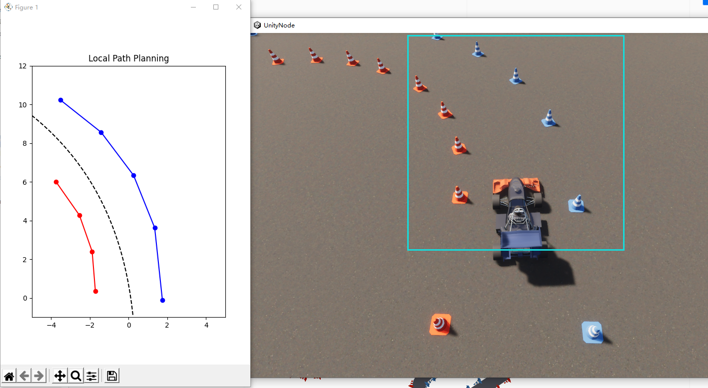
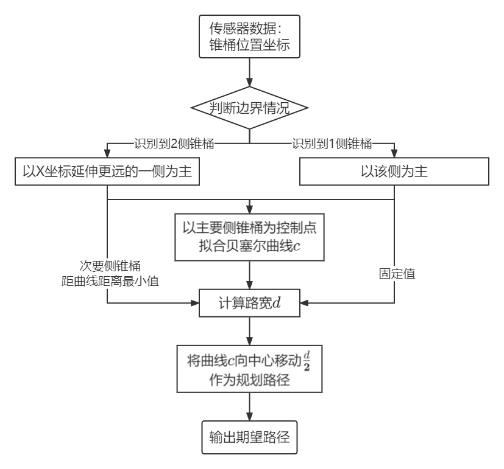
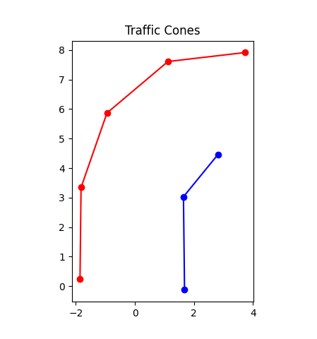
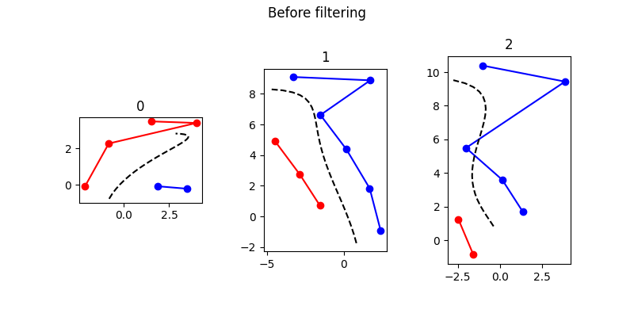
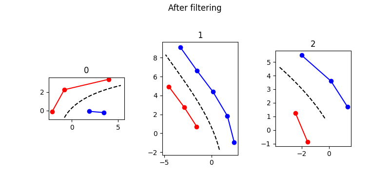
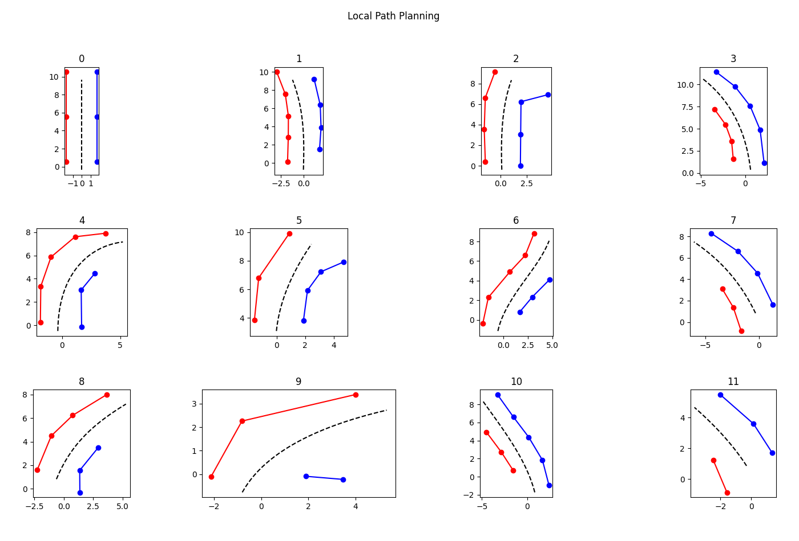

# FSAE 无人赛车路径规划算法

参加 CIAC2022 算法挑战赛的过程中，在[冀速车队](https://gitee.com/jscd_1)的小伙伴们的帮助下，开发了此用于 FSAE 无人赛车高速循迹项目的局部路径规划算法。由于时间仓促、缺乏经验，此算法仍有诸多不足之处。现将代码全部[开源](https://github.com/muziing/PythonAutomatedDriving/tree/main/LocalPathPlanning/FSAE_PathPlanning)，旨在抛砖引玉、增加交流。


## 背景

### 赛道布局

- 直线：不超过80m
- 定半径弯：直径最大50m
- 发夹弯：最小外径9m（弯折处）
- 最小车道宽度为3m
- 复杂赛道：连续弯道、减小半径转弯等
- 赛道左侧边界标记为红色锥桶
- 赛道右侧边界标记为蓝色锥桶
- 赛道两侧不存在边界线
- 赛道终点计时线后安全停车区标记为两侧黄色锥桶
- 同侧锥桶间最大距离为5m
- 在转角处，同侧锥桶间的距离会略有缩小，以提供更好的识别效果
- 赛道标识锥桶根据具体情况会进行间距与宽度调整，且不保证一一对应的状态

### 仿真平台

基于 [PanoSim](http://www.panosim.com/) 仿真平台进行测试。



### 传感器

传感器为赛事官方为比赛设计的「目标级雷达」，仅限于在 PanoSim 仿真平台中使用，与真实物理传感器差别较大。按此处使用方式，可将其简单理解为前视摄像头与激光雷达组合：能识别车辆行驶方向前方一定距离一定宽度内的所有锥桶、并返回每个锥桶相对车辆坐标系的位置坐标。



## 算法详解

### 总体设计思路

> 本节对应算法中的主函数 `local_path_fitting()`

算法主要流程如下图：



将离散的锥桶坐标作为控制点，可以拟合出连续平滑的贝塞尔曲线（车道边界线）。考虑到进入弯道后内侧锥桶可见情况极差、内外侧锥桶数量不保证一一对应，舍弃「分别拟合两侧车道边界线、再取中心为期望路径」的方案，而使用「将一侧车道线进行适当平移作为期望路径」方案。为便于表述，下文将用于拟合的这一侧锥桶称为“主要侧”。

### 传感器数据处理

> 本节对应算法中的 `get_traffic_cone_matrix()` 函数

传感器返回的数据示例如下：

```python
test_data = [
    (1017, 2, 3.343387449437274, 1.8235284646302428),
    (1018, 2, 5.867827908680232, 0.944779519389953),
    (1019, 2, 7.6091855208348225, -1.1205953728195666),
    (1020, 2, 7.913549020138137, -3.727770636814051),
    (1117, 11, -0.12286178543346227, -1.6824113908721865),
    (1118, 11, 3.030101167823757, -1.6460322572791233),
    (1119, 11, 4.45810309689678, -2.812570004534515),
    (1218, 2, 0.2487513787190473, 1.8585494303263963),
]
```

- 格式为二维矩阵，每行含义为 `[锥桶序号, 锥桶颜色, x坐标, y坐标]`
- 序号以 1000 起始，与相对位置无必然联系，原始数据严格按序号排列；
- 颜色：2-左侧红锥桶、11-右侧蓝锥筒、13-起终点黄锥桶；
- 坐标为车辆坐标系，单位`[m]`，感知范围：`[-1:12,-4.5:4.5]`；

使用函数 `get_traffic_cone_matrix()` 对原始数据进行处理：每次按颜色筛选出单侧锥桶，按 x 坐标重新排序，形成单侧坐标矩阵。



### 边界线拟合

> 本节对应算法中的 `get_bezier_curve()` 函数

由高速循迹赛道的复杂性（变半径弯道、连续转弯、发卡弯等），不宜使用最小二乘法拟合直线与定半径圆。故先以折线法连接锥桶坐标，再用贝塞尔曲线进行平滑处理。


贝塞尔曲线连接点平滑、描述曲线特性能力强，如图所示，基本反映了车道边界线情况。

### 车道宽度计算

> 本节对应算法中的 `get_road_width()` 函数

按[赛道布局](#赛道布局)要求，车道宽度最小值为3m，非固定值，需要计算当前路段的车道宽度，为计算平移距离提供依据。对于可同时感知到车道两侧锥桶的情况，以车道线间最小距离为车道宽度；对于只能感知到一侧锥桶的情况，则近似认为车道宽度为 3m。

[`scipy.spatial.distance`](https://docs.scipy.org/doc/scipy/reference/spatial.distance.html) 模块中提供了多种用于计算距离的函数。其中 `cdist()` 函数用于计算两个输入集合的每一对之间的距离。

将主要侧拟合出的曲线、次要侧的锥桶两个二维向量作为参数传入 `cdist()`，返回值为次要侧锥桶坐标到曲线上各点距离，简单地认为其中的最小值即为车道宽度。

### 平移车道线

> 本节对应算法中的 `get_translation()` 函数

记[车道宽度](#车道宽度计算)为 d，将主要侧车道线向内平移 d/2、向后平移 d/4 作为规划路径。


### 排除异常锥桶干扰

> 本节对应算法中的 `filter_traffic_cone()` 函数

由于传感器探测范围较宽，在急弯、特别是掉头弯处可能会出现非本侧车道边界锥桶被检测到，而严重影响路径规划的情况。



提出一种简易过滤算法：首先根据与车辆最近锥桶 y 坐标变化方向判断弯道方向（左转、右转或直行），然后反复遍历所有锥桶计算 Δy，每次剔除首个 y 坐标变化方向相反的锥桶。

经尝试，此过滤算法可一定程度上解决识别到异常的问题，但效果仍不理想，有待进一步改进。



## 总结

如图，这种方式获得的期望路径在前半段效果较好，基本处于车道中心，且光滑平顺，达到设计要求；后半段效果稍差，会有偏向主要侧的趋势，但考虑到车辆在行驶到后半段期望轨迹之前已经进行下一次局部路径规划，故可以接受。


